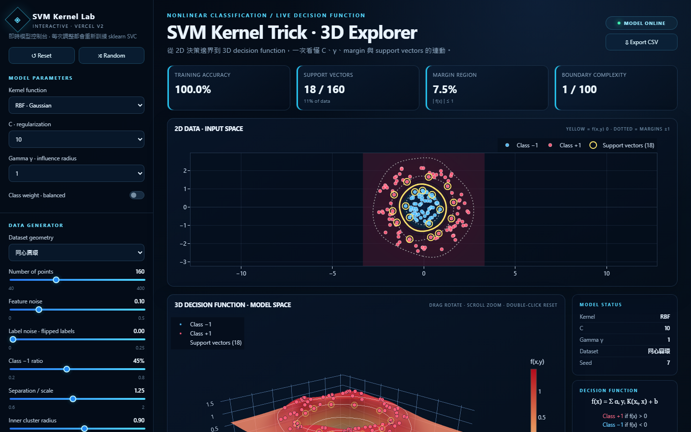

**Live Demo：<https://svm-kernel-2nhlfdtkz-newmume-s-projects.vercel.app/>**

# SVM Kernel Lab

用互動圖形認識 SVM（Support Vector Machine）。每次調整參數，系統都會用 scikit-learn 重新訓練模型，並同步更新 2D 決策邊界、3D decision function 與模型指標。

Learn Support Vector Machines through interactive visualizations. Every parameter change retrains a scikit-learn model and updates the 2D decision boundary, 3D decision function, and model metrics.

## 中文快速上手

### 第一次操作：照這 6 步就能看懂

1. **等待模型完成**：右上角顯示 `MODEL ONLINE` 後再開始操作。參數改變時會短暫顯示 `COMPUTING`，代表模型正在重新訓練。
2. **先用預設組合**：保持「同心圓環 + RBF」，觀察黃色的決策邊界如何把藍色內圈與紅色外圈分開。
3. **認識 2D 圖**：圓點是資料；黃色實線是 $f(x)=0$ 的決策邊界；白色虛線是 $f(x)=\pm1$ 的 margin；黃色外框的點是 support vectors。
4. **認識 3D 圖**：高度代表 decision function $f(x_1,x_2)$。曲面穿過 $z=0$ 的位置，就是 2D 圖上的黃色決策邊界。
5. **一次只改一個參數**：先改 Gamma，再改 C，最容易看出各參數的效果。每次都等 `MODEL ONLINE` 再比較。
6. **重設或匯出**：按 `Reset` 回到預設值；按 `Random` 更換資料種子；按 `Export CSV` 下載目前資料與模型分數。

### 建議的 5 分鐘練習

| 練習 | 操作 | 應觀察的現象 |
| --- | --- | --- |
| 1. 看 Gamma | 選 RBF，依序比較 $\gamma=0.1, 1, 10$ | Gamma 越大，單一資料點的影響範圍越小，邊界通常更彎曲、更貼近資料。 |
| 2. 看 C | 將 Label noise 調到約 `0.10`，比較 $C=0.3$ 與 $C=100$ | C 越大越不容許訓練錯誤，也可能更容易追著雜訊跑。 |
| 3. 比較 Kernel | 保持同心圓環，先選 Linear，再切回 RBF | Linear 很難分開內外圓環；RBF 可以形成封閉曲線。 |
| 4. 看 Support Vectors | 改變 C 或 Gamma，觀察黃色外框點與 `SUPPORT VECTORS` | 這些點直接影響決策邊界；其他較遠的點通常不會改變邊界。 |

### 控制項速查

| 控制項 | 用途 | 初學者提示 |
| --- | --- | --- |
| Kernel function | 選擇 Linear、Polynomial、RBF 或 Sigmoid | 不知道怎麼選時先用 RBF。 |
| C · regularization | 控制錯分懲罰 | 小 C 較寬容、邊界較平滑；大 C 更重視訓練資料。 |
| Gamma γ | 控制單一樣本的影響範圍 | 小 γ 影響較遠；大 γ 影響較局部。Linear 不使用 γ。 |
| Degree | Polynomial 的多項式階數 | 階數越高，可形成的曲線越複雜。 |
| Coef0 | Polynomial 與 Sigmoid 的獨立項 | 初學時可先保持預設值。 |
| Dataset geometry | 切換同心圓環、交錯月牙、XOR 或線性可分 | 用同一組參數比較不同資料形狀。 |
| Feature noise | 擾動資料點的位置 | 越高代表資料越分散。 |
| Label noise | 隨機翻轉部分標籤 | 適合觀察模型如何處理錯誤標籤。 |
| View options | 顯示或隱藏 heatmap、margin、support vectors 與 3D 圖層 | 圖太複雜時，可暫時關閉部分圖層。 |
| 3D camera | 調整方位角、仰角與縮放 | 也可直接拖曳旋轉、滾輪縮放、雙擊重設視角。 |

四個指標都是目前資料的即時計算結果：

- **Training Accuracy**：訓練資料的正確分類比例；高分不一定代表對新資料也表現良好。
- **Support Vectors**：直接決定邊界的資料點數量與比例。
- **Margin Region**：落在 $|f(x)|\le1$ 區域內的資料比例。
- **Boundary Complexity**：邊界彎曲程度的視覺化指標，適合比較目前 Demo 的不同設定。

## English Quick Start

### Your first run in 6 steps

1. **Wait for the model**: start when the top-right status reads `MODEL ONLINE`. `COMPUTING` means the model is being retrained.
2. **Keep the default setup**: use concentric rings with the RBF kernel. The yellow boundary should separate the blue inner cluster from the red outer ring.
3. **Read the 2D plot**: dots are samples; the solid yellow line is the $f(x)=0$ decision boundary; dotted white lines are the $f(x)=\pm1$ margins; yellow-outlined samples are support vectors.
4. **Read the 3D plot**: height represents the decision function $f(x_1,x_2)$. Where the surface crosses $z=0$ corresponds to the yellow boundary in the 2D plot.
5. **Change one setting at a time**: test Gamma first, then C. Wait for `MODEL ONLINE` before comparing results.
6. **Reset or export**: `Reset` restores defaults, `Random` changes the data seed, and `Export CSV` downloads the current samples and model scores.

### Recommended 5-minute learning path

| Experiment | What to do | What to look for |
| --- | --- | --- |
| 1. Explore Gamma | With RBF selected, compare $\gamma=0.1, 1, 10$ | A larger Gamma gives each sample a smaller influence radius, often producing a more detailed boundary. |
| 2. Explore C | Set Label noise to about `0.10`; compare $C=0.3$ and $C=100$ | A larger C penalizes training errors more strongly and may follow noisy samples too closely. |
| 3. Compare kernels | Keep concentric rings; switch from Linear to RBF | Linear cannot easily separate nested rings, while RBF can form a closed boundary. |
| 4. Find support vectors | Change C or Gamma and watch the yellow-outlined points | These samples directly determine the position of the decision boundary. |

### Control reference

| Control | Purpose | Beginner tip |
| --- | --- | --- |
| Kernel function | Select Linear, Polynomial, RBF, or Sigmoid | Start with RBF if you are unsure. |
| C · regularization | Set the penalty for classification errors | Small C is more tolerant; large C focuses more on fitting the training data. |
| Gamma γ | Set the influence radius of each sample | Small γ reaches farther; large γ is more local. Linear does not use γ. |
| Degree | Set the Polynomial kernel order | Higher values allow more complex curves. |
| Coef0 | Set the independent term for Polynomial and Sigmoid | Keep the default value during your first experiments. |
| Dataset geometry | Choose rings, moons, XOR, or linearly separable data | Compare kernels on the same geometry first. |
| Feature noise | Add positional noise to samples | Higher values create more scattered data. |
| Label noise | Randomly flip some class labels | Use it to study robustness and overfitting. |
| View options | Toggle heatmap, margins, support vectors, and 3D layers | Hide layers when the plot feels too busy. |
| 3D camera | Change azimuth, elevation, and zoom | You can also drag to rotate, scroll to zoom, and double-click to reset. |

The four metric cards are calculated from the current data:

- **Training Accuracy**: fraction of training samples classified correctly; a high score does not guarantee good performance on unseen data.
- **Support Vectors**: number and ratio of samples that directly determine the boundary.
- **Margin Region**: fraction of samples inside $|f(x)|\le1$.
- **Boundary Complexity**: a visual comparison score for how strongly the current boundary bends in this demo.

## 數學說明 / Math Guide

### 1. Soft-margin SVM

SVM 會在「較寬的 margin」與「較少的訓練錯誤」之間取捨：

SVM balances a wider margin against fewer training errors:

$$
\min_{w,b,\xi}\ \frac{1}{2}\lVert w\rVert^2 + C\sum_{i=1}^{n}\xi_i
$$

subject to

$$
y_i\bigl(w^T\phi(x_i)+b\bigr) \ge 1-\xi_i,\qquad \xi_i\ge0
$$

$C$ 越大，違反 margin 或分類錯誤的代價越高；$C$ 越小，模型容許更多違反，以換取較強的正規化。A larger $C$ penalizes margin violations more strongly, while a smaller $C$ allows more violations for stronger regularization.

### 2. Decision function

Kernel SVM 的預測來自：

$$
f(x)=\sum_{i\in SV}\alpha_i y_i K(x_i,x)+b
$$

- $f(x)>0$：預測 Class $+1$；predict Class $+1$.
- $f(x)<0$：預測 Class $-1$；predict Class $-1$.
- $f(x)=0$：決策邊界；the decision boundary.
- $f(x)=\pm1$：margin 線；the margin lines.
- $SV$：support vectors，也就是真正參與決定邊界的樣本。

3D 圖畫的是 $z=f(x_1,x_2)$，不是 kernel 映射後的真實特徵空間。The 3D plot shows the decision-function height, not the actual high-dimensional feature space created by the kernel.

### 3. Kernel functions

| Kernel | 公式 / Formula | 直觀理解 / Intuition |
| --- | --- | --- |
| Linear | $K(x,z)=x^Tz$ | 產生線性邊界。Creates a linear boundary. |
| Polynomial | $K(x,z)=(\gamma x^Tz+r)^d$ | 用多項式交互作用形成曲線。Uses polynomial interactions to create curved boundaries. |
| RBF / Gaussian | $K(x,z)=\exp(-\gamma\lVert x-z\rVert^2)$ | 依距離衡量相似度，適合非線性資料。Measures similarity by distance and works well for nonlinear data. |
| Sigmoid | $K(x,z)=\tanh(\gamma x^Tz+r)$ | 形式類似神經網路啟用函數。Resembles a neural-network activation function. |

Kernel trick 讓模型只需計算 $K(x,z)$，不必直接建立高維座標 $\phi(x)$。The kernel trick evaluates inner products in an implicit feature space without explicitly constructing the high-dimensional coordinates.
